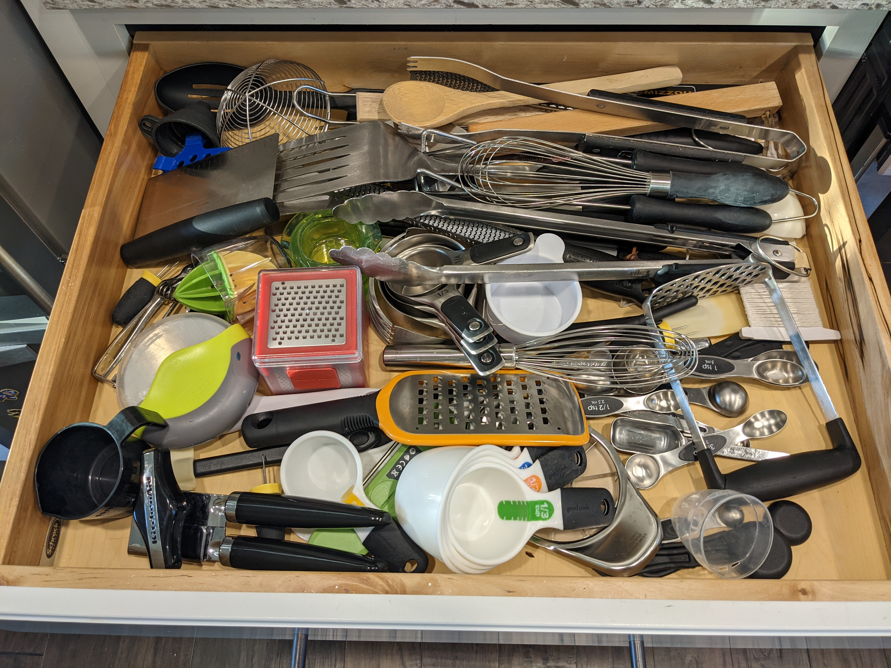
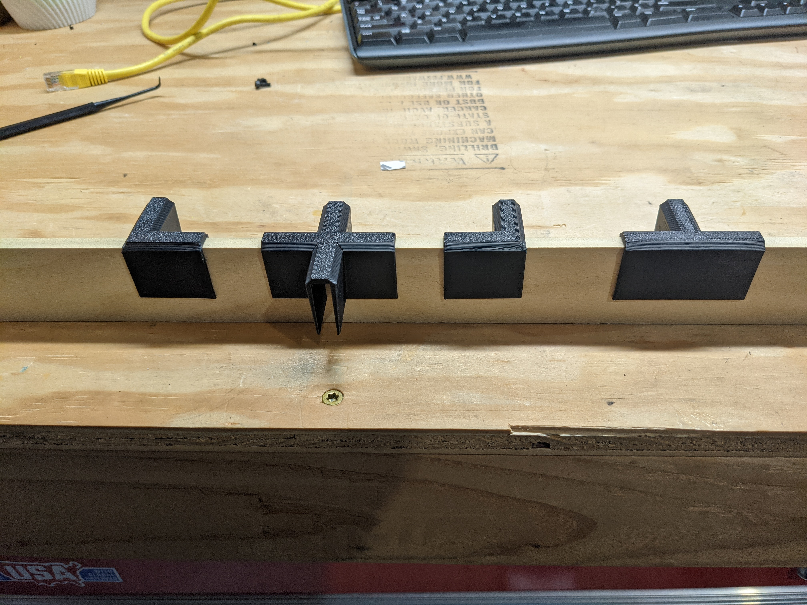
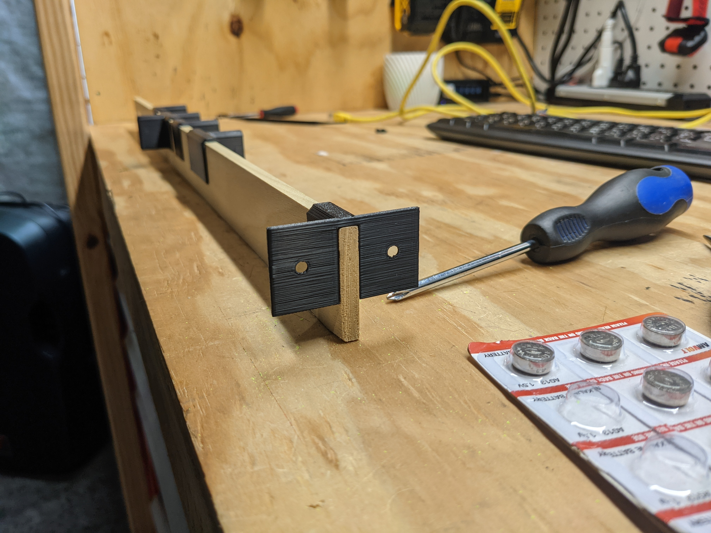
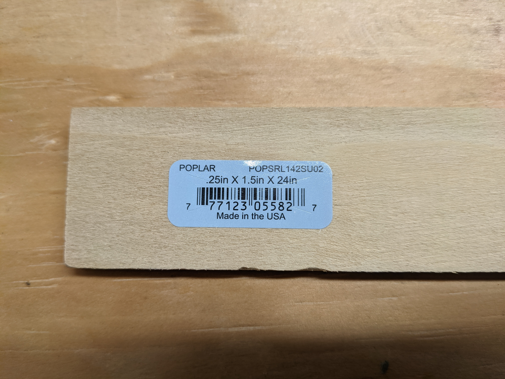

# drawer-organization
## The Problem
I've grown tired of the chaotic mess that is my kitchen drawers.  Here is once of my most used drawers(and most poorly organized).

I've attempted to put certain things like measuring cups and spoons in the front, but over time they drift into a purely random hodgepodge of kitchen utensils and drawer jams.  

## Potential Solutions
Can I use a 3d printer to(cheaply) fix this issue?  Let's look at a few different options:

### Modular Drawer Organizer by wbu42
https://www.thingiverse.com/thing:3827538

This is exactly what I imagined when originally thought about solving this problem with a 3d printer.

### Kitchen Drawer Organizer Brackets/Braces by mrmacnology
https://www.thingiverse.com/thing:2898716

This one doesn't look as nice but uses wood as the main build medium.  

### Universal Drawer Organizers (IKEA ALEX)
https://www.thingiverse.com/thing:4774688

I like this idea but it seems more geared to office drawers.

## Choosing a Solution and Mock Design
While I like the look of "Modular Drawer Organizer", I think wood is going to be easier for me to create some of the longer sections I believe will be needed.

